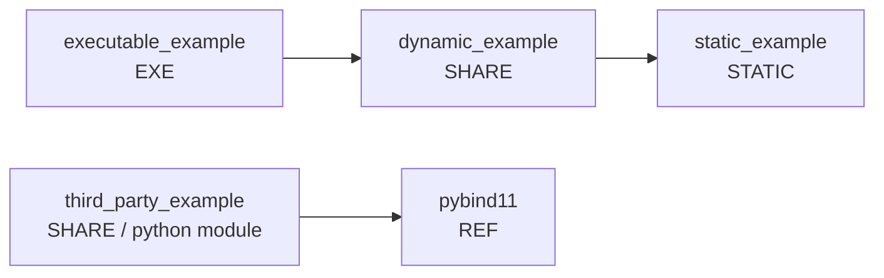

# Matching Engine

A high-performance trading order matching engine that processes and executes trades based on matching buy and sell orders on an exchange.

## Overview

This project implements a matching engine that:
- Processes order requests (add/remove operations)
- Matches buy and sell orders based on price and time priority
- Executes trades when buy price ≥ sell price
- Maintains an order book with proper priority resolution
- Outputs trade execution details and order state changes

## Features

- **Price-Time Priority Matching**: Orders are matched at the best price first, with earliest orders matched first at the same price
- **Aggressive Order Handling**: Incoming orders that cross the spread are matched against resting orders in priority order
- **Order Book Management**: Maintains separate buy (descending price) and sell (ascending price) books
- **Partial Fill Support**: Orders can be partially filled with remaining quantity resting in the book

## Quick Start

```bash
# Build the matching engine
cmake -S . -B build -G Ninja
cmake --build build

# Run the matching engine
LD_LIBRARY_PATH=build/lib64 ./build/bin/matching_engine_app

# See example usage
bash QUICKSTART.sh
```

## Project Structure

- [matching_engine/matching_engine_core/](matching_engine/matching_engine_core) — Core matching engine library
- [matching_engine/matching_engine_app/](matching_engine/matching_engine_app) — Application and CLI interface
- [Matching_Engine_Requirement.md](Matching_Engine_Requirement.md) — Full specification and requirements
- [MATCHING_ENGINE_IMPLEMENTATION.md](MATCHING_ENGINE_IMPLEMENTATION.md) — Implementation details

---

## Controlling the build tree

CMake decides *where* build artifacts go from the argument you pass to `-B`
(the **binary dir**). `-S` is the **source dir**. Everything CMake generates —
object files, libraries, executables, and the `bin/`, `lib64/`, `symbol/`
folders — is written under the binary dir. The source tree is never touched.

```bash
cmake -S <source-dir> -B <build-dir> -G Ninja
cmake --build <build-dir>
```

Common choices:

```bash
# In-tree build folder (git-ignored)
cmake -S . -B build

# Any out-of-tree location you like
cmake -S . -B /tmp/super_cmake-build
```

### super_make-style sibling build tree

super_make places its output in a **sibling** directory next to the project,
named `<project>_build/<project>_<config>`. For a project checked out at
`/work/super_cmake` that means:

```
/work/super_cmake            <- source
/work/super_cmake_build/     <- build output (sibling)
```

Reproduce that exactly by pointing `-B` at the sibling path. The pattern is
`../<name>_build/<name>_<config>`:

```bash
# Release (super_make's default CONFIG)
cmake -S . -B ../super_cmake_build/super_cmake_release -G Ninja
cmake --build ../super_cmake_build/super_cmake_release

# Debug
cmake -S . -B ../super_cmake_build/super_cmake_debug -G Ninja -DCMAKE_BUILD_TYPE=Debug
cmake --build ../super_cmake_build/super_cmake_debug
```

This gives you the same on-disk shape super_make produced:

```
../super_cmake_build/super_cmake_release/bin/executable_example
../super_cmake_build/super_cmake_release/lib64/libdynamic_example.so.0.0.1
../super_cmake_build/super_cmake_release/symbol/libdynamic_example.so.0.0.1.sym
```

A tiny wrapper reproduces super_make's zero-argument workflow:

```bash
# build.sh — mimic `make` with a sibling release tree
name=$(basename "$PWD")
tree="../${name}_build/${name}_release"
cmake -S . -B "$tree" -G Ninja
cmake --build "$tree"
```

> Keeping build trees **out of the source directory** is the recommended CMake
> practice: you can wipe a build tree (`rm -rf build`) without risk, and keep
> Release and Debug trees side by side. The [.gitignore](.gitignore) already
> excludes `build*/`, `cmake-build-*/`, and `*_build/`.

---

## Build configuration (Release / Debug)

The configuration maps to super_make's `CONFIG` variable and defaults to
`Release` (super_make defaults to `release`).

```bash
cmake -S . -B build -G Ninja                          # Release (default)
cmake -S . -B build-dbg -G Ninja -DCMAKE_BUILD_TYPE=Debug
```

| Aspect | Release | Debug |
| --- | --- | --- |
| Optimisation | `-O3` | none |
| `-g` debug info | yes (then split out) | yes (kept in binary) |
| Symbol stripping | binaries stripped, debug info saved to `symbol/*.sym` | not stripped |

This mirrors `common.mk`'s `TRIM_SYMBO` behaviour: in Release the shippable
artifacts (executables and shared libraries) are stripped with `strip`, and
their debug info is preserved separately via
`objcopy --only-keep-debug` in the `symbol/` folder.

---

## Output layout

Each configuration gets its own subtree, and the short `bin/`, `lib64/`,
`symbol/` paths are **symlinks to the active configuration** — the same idea as
super_make keeping `<proj>_build/<proj>_release` and `<proj>_build/<proj>_debug`
side by side and symlinking `<proj>_build/<proj>` to the active one
(`LIB_DIR=lib64`, `BIN_DIR=bin` as in `common.mk`):

```
<build-dir>/
├── debug/                       # populated when configured with Debug
│   ├── bin/
│   ├── lib64/
│   └── symbol/
├── release/                     # populated when configured with Release
│   ├── bin/
│   │   ├── executable_example -> executable_example.0
│   │   ├── executable_example.0 -> executable_example.0.0.1
│   │   └── executable_example.0.0.1
│   ├── lib64/
│   │   ├── libstatic_example.a -> libstatic_example.a.0
│   │   ├── libstatic_example.a.0 -> libstatic_example.a.0.0.1
│   │   ├── libstatic_example.a.0.0.1
│   │   ├── libdynamic_example.so -> libdynamic_example.so.0
│   │   ├── libdynamic_example.so.0 -> libdynamic_example.so.0.0.1
│   │   └── libdynamic_example.so.0.0.1
│   └── symbol/                  # split debug symbols (Release only)
│       ├── executable_example.0.0.1.sym
│       └── libdynamic_example.so.0.0.1.sym
├── bin    -> release/bin        # symlink to the active configuration
├── lib64  -> release/lib64      # symlink to the active configuration
└── symbol -> release/symbol     # symlink to the active configuration
```

Because `debug/` and `release/` coexist in a single build tree, reconfiguring
the same `-B` directory with a different `CMAKE_BUILD_TYPE` just re-points the
`bin/`, `lib64/`, and `symbol/` symlinks — no rebuild of the other config is
lost, and tools (like the debugger) can always use the stable `build/bin` and
`build/lib64` paths.

**Every artifact is versioned.** Executables, static archives, and shared
libraries are all produced under a `.<version>` name with a base → major →
version symlink chain, matching super_make's `TARGET_LINK_NAME` rules:

| Kind | Real file | Symlinks |
| --- | --- | --- |
| Executable | `executable_example.0.0.1` | `executable_example` → `.0` → `.0.0.1` |
| Static lib | `libstatic_example.a.0.0.1` | `libstatic_example.a` → `.a.0` → `.a.0.0.1` |
| Shared lib | `libdynamic_example.so.0.0.1` | `libdynamic_example.so` → `.so.0` → `.so.0.0.1` |

Shared libraries additionally carry a SONAME of `lib<name>.so.<major>`, matching
super_make's `-Wl,-soname,...`. The version comes from the module's `VERSION`
variable (default `0.0.1`); the `<major>` link uses its first component.

---

## Writing a module

Each module is a directory containing a `CMakeLists.txt` that sets a few
variables and calls `super_module()`. The module **name is taken from the
directory name** (just like super_make derives it from the folder).

### Module variables

All are optional and read from the calling scope:

| Variable | Meaning | Default |
| --- | --- | --- |
| `TYPE` | `EXE` \| `STATIC` \| `SHARE` \| `REF` \| `NONE` | `NONE` |
| `DEPS` | sibling module names this module links against (transitive) | — |
| `DEP_PKGS` | `pkg-config` package names | — |
| `VERSION` | `x.y.z`; drives the soname/symlink chain | `0.0.1` |
| `STD` | C++ standard: `c++NN`, `gnu++NN`, or `NN` | `c++17` |
| `LIB_PREFIX` | library name prefix; set to `""` to drop the `lib` prefix | `lib` |
| `SHARE_SUFFIX` | shared-library suffix (alias: `SHARE_SUBFFIX`) | `.so` |
| `C_FLAGS` / `CPP_FLAGS` | extra per-language compile flags | — |
| `EXE_FLAGS` / `SHARE_FLAGS` | extra link flags | — |
| `INC_PATHS` / `LIB_PATHS` / `LIBS` | extra include dirs / link dirs / libraries | — |

Every compiled module also gets the fixed diagnostic set from `common.mk`
(`-Werror -Wfatal-errors -Wformat=2 -Winit-self -Wswitch-default -Wall -Wextra -g`),
is built position-independent (`-fPIC`), and receives the preprocessor macros
`-DTARGET_NAME=<name>` and `-DPYINIT=PyInit_<name>`.

### Module directory layout

```
<module>/
├── CMakeLists.txt      # set(TYPE ...) ; super_module()
├── src/                # *.c and *.cpp translation units
└── inc/                # public headers (exported to modules that DEP on this one)
```

Headers under `inc/` are added as a **public** include directory, so any module
that lists this one in its `DEPS` automatically sees them — no manual include
paths needed.

### Module TYPEs

| `TYPE` | Produces | Notes |
| --- | --- | --- |
| `STATIC` | `lib<name>.a` | static archive |
| `SHARE` | `lib<name>.so.<ver>` + soname chain | `-Wl,--no-undefined`, versioned |
| `EXE` | `<name>` in `bin/` | executable |
| `REF` | *(nothing compiled)* | header-only; exports `inc/` as an interface |
| `NONE` | *(nothing)* | aggregator: recurses into every child dir that has a `CMakeLists.txt` |

---

## Adding a new module

1. Create the directory and its `src/` / `inc/` folders:

   ```bash
   mkdir -p example/my_lib/src example/my_lib/inc/my_lib
   ```

2. Add sources and public headers:

   ```cpp
   // example/my_lib/inc/my_lib/greeter.hpp
   #pragma once
   namespace demo { void hello(); }
   ```

   ```cpp
   // example/my_lib/src/greeter.cpp
   #include <my_lib/greeter.hpp>
   #include <iostream>
   void demo::hello() { std::cout << "hello\n"; }
   ```

3. Add `example/my_lib/CMakeLists.txt`:

   ```cmake
   set(TYPE SHARE)
   set(DEPS static_example)   # optional: link another module
   super_module()
   ```

That's it. `example/`'s `NONE` aggregator auto-discovers the new directory the
next time you configure — no need to edit any parent `CMakeLists.txt`.

---

## The bundled example

`example/` reproduces super_make's own `example/` project and exercises every
feature:

| Module | `TYPE` | Depends on | Demonstrates |
| --- | --- | --- | --- |
| [static_example](example/static_example) | `STATIC` | — | static archive |
| [dynamic_example](example/dynamic_example) | `SHARE` | `static_example` | shared lib, soname, links a static lib |
| [executable_example](example/executable_example) | `EXE` | `dynamic_example` | executable with transitive deps |
| [pybind11](example/pybind11) | `REF` | — | header-only interface module |
| [third_party_example](example/third_party_example) | `SHARE` | `pybind11` | `DEP_PKGS`, `LIB_PREFIX ""`, `SHARE_SUFFIX .so`, `TARGET_NAME` macro |

The dependency graph:



### Note on the Python module

`third_party_example` builds a pybind11 Python extension. super_make used
`DEP_PKGS:=python3`; modern CPython moved the embed link flags into a separate
`python3-embed.pc`, and because `common.mk`'s shared-library recipe always links
with `-Wl,--no-undefined`, libpython must be resolvable at link time. The module
therefore depends on `python3-embed` and **self-skips** (with a status message)
when the Python development package is absent, so the rest of the project still
configures and builds without `python3-dev`.

---

## Feature mapping to common.mk

| `common.mk` | `SuperCMake.cmake` |
| --- | --- |
| `TYPE` EXE/STATIC/SHARE/REF/NONE | `add_executable` / `add_library(STATIC\|SHARED\|INTERFACE)` / recursive `add_subdirectory` |
| `DEPS` + `get_deps` transitive resolution | `target_link_libraries(PUBLIC)` (CMake resolves transitivity, include & link order) |
| `DEP_PKGS` via `pkg-config --cflags/--libs` | `pkg_check_modules(... IMPORTED_TARGET)` |
| `VERSION` + soname + `.so.x.y.z` symlink chain | `VERSION` / `SOVERSION` (shared) + POST_BUILD symlink chain (static & executable) |
| `STD` (default `c++17`) | `CXX_STANDARD` |
| `LIB_PREFIX` / `SHARE_SUBFFIX` | `PREFIX` / `SUFFIX` target properties |
| `BASE_COMPILE_FLAG` warnings + `-fPIC` + `-g`, `-O3` release | `target_compile_options` + `POSITION_INDEPENDENT_CODE` + Release config |
| `-DTARGET_NAME` / `-DPYINIT` | `target_compile_definitions` |
| `-Wl,--no-undefined` (shared) | `target_link_options` |
| `TRIM_SYMBO` (`objcopy --only-keep-debug` + `strip`) | POST_BUILD custom command (Release only) |
| `../<proj>_build/<proj>_<config>/{bin,lib64}` | `RUNTIME`/`LIBRARY`/`ARCHIVE_OUTPUT_DIRECTORY` + your `-B` choice |

The implementation lives in [cmake/SuperCMake.cmake](cmake/SuperCMake.cmake).
